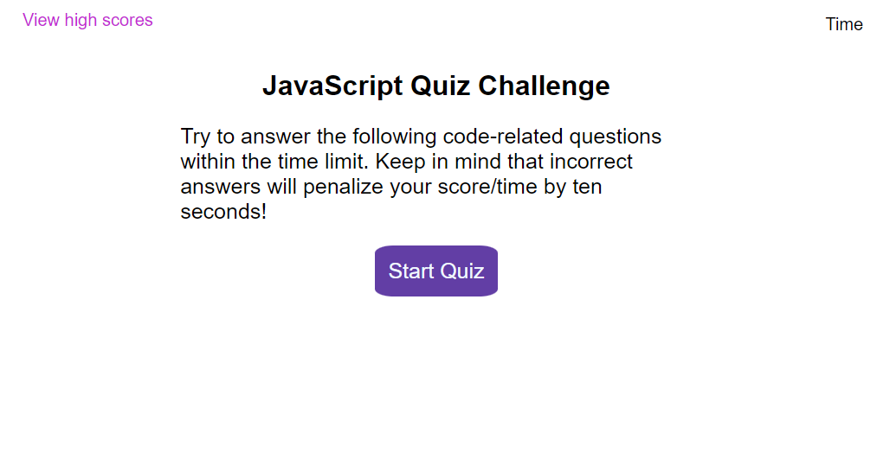

# JavaScript Coding Quiz

## Description

This is a timed coding quiz with multiple-choice questions. It runs in the browser and features HTML and CSS powered by JavaScript. With its responsive user interface, those learning to code can test their knowledge on JavaScript fundamentals and store their high scores so they can gauge their progress.

## Installation

N/A

## Usage

To get started, follow the link: https://sandragruiz.github.io/javascript-quiz-app/ 

To take the quiz, click on the 'Start Quiz' button. Answer the five multiple choice questions by clicking on one of four possible answers for each; you will be given a minute to answer all questions. The timer can be seen on the top right corner of the screen. If you answer incorrectly, ten seconds will be deducted from the remaining time. When the timer runs out or when you've answered all questions, you will be given your final score and an option to save it using your initials. You will be given the option to clear the high scores or go back and retake the quiz. If you wish to view the saved high scores, you can click the 'View high scores' button on the top left corner of your screen.

## Credits

N/A

## License

None

